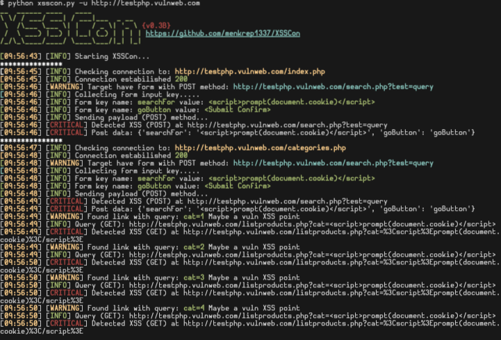

<p align="center">
 <br/>
Simple XSS Scanner made with python 3.7
</p>
## Installing
Requirements: <br/>
<li> bs4 lib </li>
<li> requests lib </li>
<li> python 3.7 </li>

```bash
git clone https://github.com/menkrep1337/XSSCon
cd XSSCon
python3 xsscon.py --help 
```
## Usage
Basic usage:
```bash
python3 xsscon.py -u http://testphp.vulnweb.com
```
<br/>
Advanced usage see help:
```bash
python3 xsscon.py --help
```
## Screenshot


